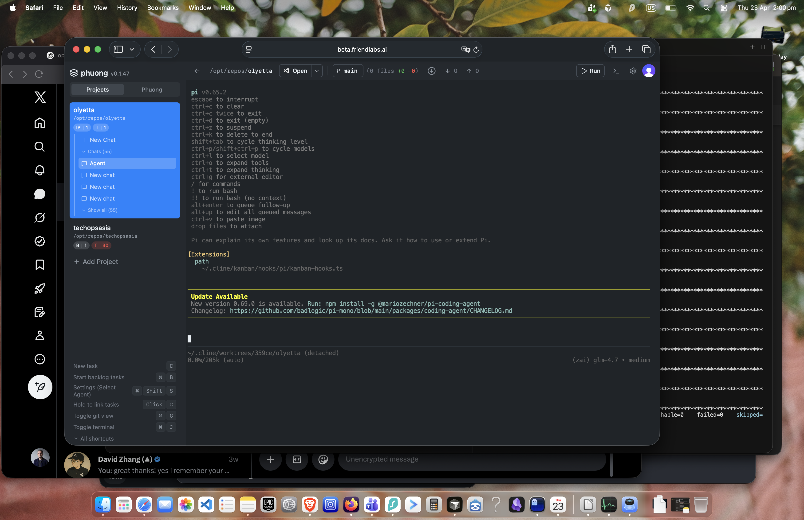

# Phuong

  

A hosted AI project manager built on a [Kanban](https://github.com/cline/kanban) fork. You chat with Phuong through a secure web dashboard. Phuong plans work, routes to agent chats, and manages project memory. Each project has multiple concurrent `pi` agent chat sessions that run independently on your VPS. Project memory lives in a separate git-backed repository.

## Status

Live at `beta.friendlabs.ai`. Phases 1–5 complete, Phase 6 (Phuong manager service) in progress. See `docs/BUILD-RUNSHEET.md` for execution details.

## UI Layout

The interface follows a projects-and-chats model (similar to Cursor's layout):

- **Left sidebar** — lists all projects; each project expands to show its agent chat sessions and a "+ New Chat" button
- **Center panel** — the active agent chat (Pi terminal or Cline SDK chat, depending on the configured agent)
- **Phuong panel** — sidebar agent chat for cross-project orchestration, planning, and memory access

There is no kanban board. The board columns still exist internally as the backing data model for chat sessions (each chat is a "task" on the board), but the board UI has been removed. The user interacts entirely through projects and chats.

## Architecture

- **Kanban fork** — runtime engine, worktree lifecycle, agent sessions, git operations, tRPC API
- **Phuong** — manager agent (chat, planning, task decomposition, memory retrieval)
- **pi** — worker agent (executes coding tasks in worktrees using GLM-5 via ZAI)
- **Memory** — external git repo (`base-control`), never in this repo
- **Auth** — Clerk with server-side JWT verification
- **Deploy** — VPS with nginx, TLS, systemd, Ansible

### How agent chats work

Each chat session is backed by a board task internally. When you click "+ New Chat" or send a message:

1. A task card is created on the internal backlog
2. The Kanban runtime creates an ephemeral git worktree for the task
3. Pi launches as a CLI process in the worktree
4. The terminal session streams output back to the browser via WebSocket
5. Multiple chats run concurrently — each has its own PTY process and worktree

Sessions persist independently. Switching between chats unmounts the terminal from the DOM but keeps the WebSocket connection and process alive.

## Docs

| Document | Purpose |
|----------|---------|
| `docs/BUILD-RUNSHEET.md` | Step-by-step build execution plan |
| `docs/KANBAN-FULL-BUILD-PLAN.md` | Full architectural plan and decisions |
| `docs/CLINE-KANBAN-ADOPTION-REPORT.md` | Evaluation of cline/kanban as the base |
| `docs/MEMORY-SEPARATION.md` | External memory repo design |
| `docs/ARCHITECTURE.md` | v1 architecture (historical reference) |
| `kanban/docs/architecture.md` | Kanban runtime and frontend architecture |

## Updating Upstream

This repo is meant to stay updateable with upstream Kanban, `pi`, and Cline package fixes.

### Kanban upstream

When upstream `cline/kanban` ships useful fixes:

1. Fetch the upstream changes into this fork.
2. Diff upstream against the current fork before merging broadly.
3. Pay special attention to the integration seam files:
   - `kanban/src/core/agent-catalog.ts`
   - `kanban/src/terminal/agent-session-adapters.ts`
   - `kanban/src/server/runtime-state-hub.ts`
   - `kanban/web-ui/src/terminal/persistent-terminal-manager.ts`
4. Prefer taking upstream behavior first, then re-applying Phuong- and `pi`-specific logic only where still needed.
5. Re-run the Kanban tests and manually verify task start, terminal behavior, and sidebar chat behavior.

### pi and Cline updates

- `pi` is integrated through Kanban's agent adapter layer plus the published `@mariozechner/pi-coding-agent` package. Prefer updating the package first, then adjust `kanban/src/terminal/agent-session-adapters.ts` only if the CLI flags, extension API, or auth behavior changed.
- Cline behavior mostly comes from the published `@clinebot/*` packages and the local `kanban/src/cline-sdk/` integration layer. Prefer updating the packages first, then diff `kanban/src/cline-sdk/` and nearby runtime wiring only if the SDK contract changed.

### Fork maintenance rule

Keep custom behavior isolated to clear seams instead of scattering fork logic through the codebase. That keeps upstream diffs smaller and makes it practical to adopt future Kanban, `pi`, and Cline fixes without a rewrite.

## Previous Version

The v1 Phuong stack (Express API, React review UI, Docker subagents) is archived in `archive/v1/` for reference.
